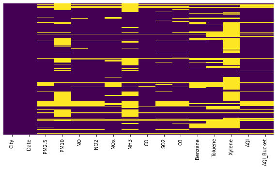
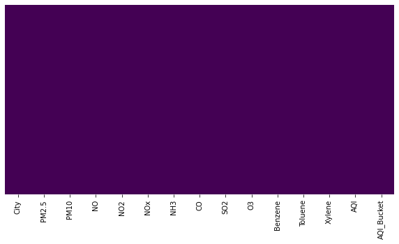

# Air_Quality_Index_Predictor
### This is a project aimed at applying different ML models on a dataset containing daily AQI values for various cities across India.

The raw input data was first preprocessed and the null values were removed.

The raw input data:

The yellow regions indicate the missing values in the data.

The data after preprocessing:

After the data was devoid of null values, the Linear Regression model was used to predict the AQI values.
The following criteria is used to judge the air quality in a city based on the AQI values.
| AQI | AQI bucket |
 :---: | :---: |
 | 0-50 | Good |
 | 51-100|Satisfactory|
 |101-200|Moderately Polluted|
 |201-300|Poor|
 |301-400|Very Poor|
 |401-500|Severe|
